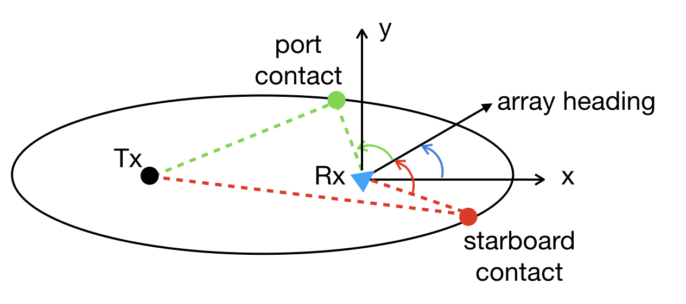

# 3D target tracking

This repository uses interval analysis and constraint programming to track a 3D target using a linear array.

## Introduction

<!--img src="pics/untrained.gif" width="300" height=250-->

## Dependencies

This repository uses the [pyibex](http://benensta.github.io/pyIbex/), a set of python modules for solving nonlinear problems using Interval Arithmetic tools.

The reccomended way of installing dependencies is through Anaconda.

A conda environment is available in conda-envs/csp-env.txt and it can be installed running:
`conda create --name csp --file conda-envs/csp-env.txt`

For convenience, it is also recommended to run:
`python -m ipykernel install --user --name csp --display-name "csp"

This adds the csp environment as an available kernel directly in jupyter notebook.
Finally, in jupyter notebook, before running the code, make sure that the csp kernel is selected.

Additional information on how to setup the necessary environment is in the notebook [00-setting-up-python-and-jupyter-with-conda-environments-on-linux-or-mac-osx.ipynb](./noteboooks/00-setting-up-python-and-jupyter-with-conda-environments-on-linux-or-mac-osx.ipynb)

## Run it

The main notebook to run is [06-bistatic-tracking.ipynb](notebooks/06-bistatic-tracking.ipynb)

Run the notebook [02-interval-methods-and-contraint-satisfaction.ipynb](notebooks/02-interval-methods-and-contraint-satisfaction.ipynb) for some background on interval analysis.

